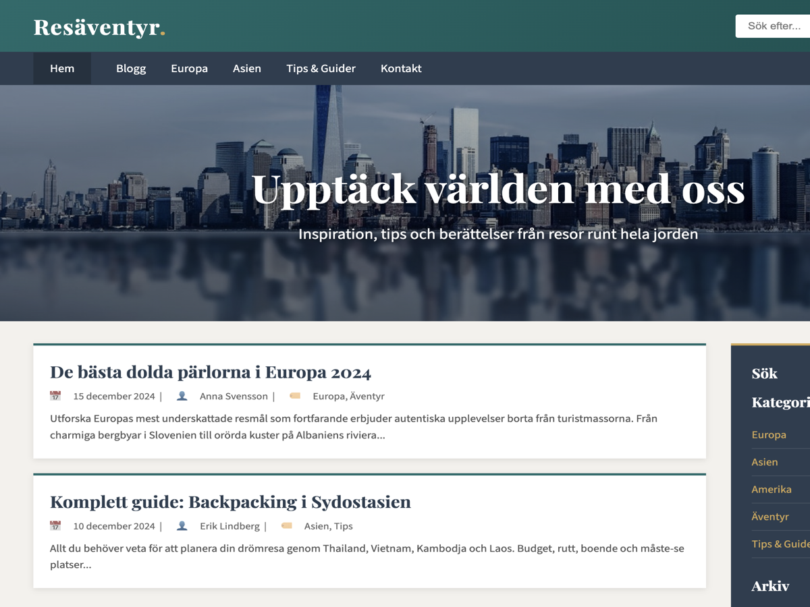

# Resäventyr - WordPress Tema

Ett anpassat WordPress-tema för en rese- och äventyrsblogg, skapat för CMS-kursen.

## 🎨 Temainformation

- **Tema:** CMS Labb 1 - Resäventyr
- **Version:** 1.0
- **Författare:** Arif
- **Text Domain:** cms-labb1

### Färgschema
| Färg | Hex | Användning |
|------|-----|------------|
| Teal | `#1a6b6b` | Primärfärg (header, knappar) |
| Guld | `#d4a853` | Accentfärg (hover, sidebar-topp) |
| Mörk | `#2c3e50` | Sidebar, footer |
| Ljus | `#f4f1ed` | Bakgrund |

### Typsnitt
- **Rubriker:** Playfair Display (Google Fonts)
- **Brödtext:** Source Sans 3 (Google Fonts)

---

## 🚀 Installation

### Förutsättningar
- Docker och Docker Compose installerat
- Eller en lokal WordPress-installation

### Steg 1: Starta WordPress med Docker

cd /path/to/cms
docker-compose up -dGå till `http://localhost:8080/wp-admin`

### Steg 2: Aktivera temat

1. Gå till **Utseende** → **Teman**
2. Hitta "CMS Labb 1 - Resäventyr"
3. Klicka **Aktivera**

---

## 🔌 Rekommenderade plugins (minst 3 st)

### 1. Contact Form 7
Kontaktformulär med e-poststöd.
1. **Tillägg** → **Lägg till nytt** → Sök "Contact Form 7"
2. Installera och aktivera
3. Gå till **Kontakt** → **Kontaktformulär**

### 2. WP Mail SMTP
Säkerställer att e-post skickas korrekt.
1. Sök "WP Mail SMTP"
2. Installera och aktivera
3. Följ setup-guiden (välj "PHP" för lokal utveckling)

### 3. Yoast SEO
Sökmotoroptimering.
1. Sök "Yoast SEO"
2. Installera och aktivera
3. Följ konfigurationsguiden

### Valfritt: Wordfence Security
Säkerhetsplugin för WordPress.

---

## 👥 Skapa användare (minst 3 st)

Gå till **Användare** → **Lägg till ny användare**

| Användarnamn | E-post | Förnamn | Efternamn | Roll |
|--------------|--------|---------|-----------|------|
| `redaktor` | redaktor@example.com | Erik | Lindberg | Redaktör |
| `forfattare` | forfattare@example.com | Anna | Svensson | Författare |
| *(din admin)* | - | - | - | Administratör |

---

## 📁 Skapa kategorier

Gå till **Inlägg** → **Kategorier**

| Namn | Slug | Beskrivning |
|------|------|-------------|
| Europa | `europa` | Resmål och äventyr i Europa |
| Asien | `asien` | Upptäck Asiens underbara platser |
| Amerika | `amerika` | Nordamerika och Sydamerika |
| Äventyr | `aventyr` | Äventyrsresor och aktiviteter |
| Tips & Guider | `tips-guider` | Praktiska resetips och guider |

---

## 📄 Skapa sidor

### Startsida
- **Titel:** "Välkommen till Resäventyr"
- **Innehåll:** Välkomsttext
- **Utvald bild:** Hero-bild
- **Mall:** Standard

### Bloggsida
- **Titel:** "Blogg"
- **Innehåll:** Lämna tomt
- **Mall:** Standard

### Undersidor (4 olika mallar)

| Sida | Mall | Layout |
|------|------|--------|
| Om oss | Undersida | Text + höger-sidebar |
| Våra resenärer | Undersida 2 | Vänster-sidebar + text |
| Integritetspolicy | Undersida 3 | Fullbredd |
| Samarbeta med oss | Undersida 4 | Text + bild till höger |

### Kontaktsida
- **Titel:** "Kontakt"
- **Mall:** Kontakt
- Visar kontaktformulär automatiskt

---

## ✍️ Skapa blogginlägg (minst 3-5 st)

Skapa inlägg med olika författare för att demonstrera funktionaliteten:

| Titel | Författare | Kategorier |
|-------|------------|------------|
| De bästa dolda pärlorna i Europa 2024 | Admin | Europa, Äventyr |
| Komplett guide: Backpacking i Sydostasien | Redaktör | Asien, Tips & Guider |
| Min resa genom Japans landsbygd | Författare | Asien, Äventyr |
| 10 saker att packa för en weekendresa | Admin | Tips & Guider |
| Roadtrip genom Island | Redaktör | Europa, Äventyr |

---

## ⚙️ Konfiguration

### Läsningsinställningar
1. **Inställningar** → **Läsning**
2. Välj "En statisk sida"
3. **Hemsida:** "Välkommen till Resäventyr"
4. **Inläggssida:** "Blogg"

### Huvudmeny
1. **Utseende** → **Menyer**
2. Skapa ny meny: "Huvudmeny"
3. Lägg till sidor: Hem, Blogg, Om oss, Våra resenärer, Samarbeta, Kontakt
4. Tilldela till "Huvudmeny"

### Widgets

**Sidebar:**
- Sök
- Senaste inlägg med bild (egen widget)
- Kategorier
- Arkiv

**Footer Widget Area:**
- Text-widget med beskrivning av webbplatsen

---

## 📁 Filstruktur
